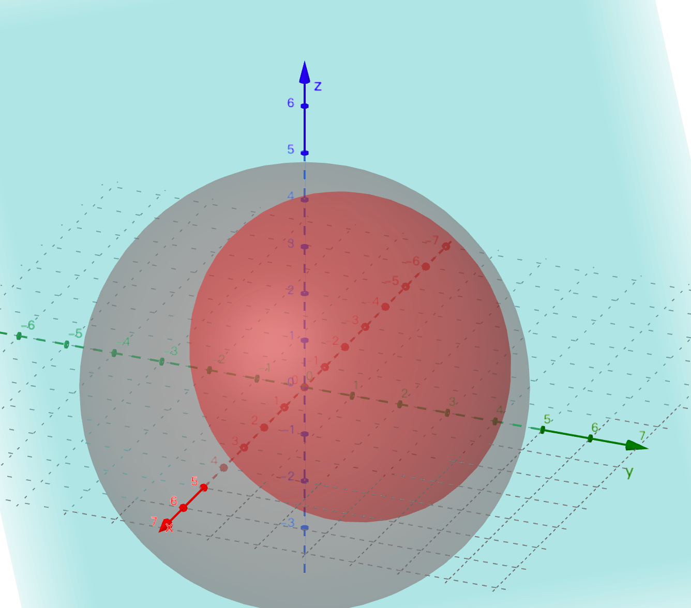

+++
title = '使用韦达定理'
date = 2024-11-02T11:11:21+08:00
draft = false
tags = ["几何","方程"]
+++

## 已知
$$
x+y+z = 5
$$
和
$$
xy+yz+xz = 3
$$

求$z$的范围

<!--more-->
## 题解

### 二次方程韦达定理
把$z$视为参数：
$$
x+y = 5-z\\\\
xy = 3-z(x+y) = 3-z(5-z)
$$
于是$x,y$是下述方程的两个根：
$$
t^2-(5-z)t+3-z(5-z)=0
$$
只要$z$的取值范围**使得此方程有解**即可找到满足题设的$x,y$，令
$$
\Delta = (5-z)^2-4(3-z(5-z))\ge 0
$$
即可解得：
$$
z \in [-1,\frac{13}{3}]
$$

### 三次方程韦达定理

设
$$
xyz = \theta
$$
那么$x,y,z$是方程
$$
f(t) = t^3-5t^2+3t=\theta
$$
的三个根：

<iframe src="https://www.desmos.com/calculator/juyycd3roy?embed" width="500" height="500" style="border: 1px solid #ccc" frameborder=0></iframe>

如图所示，绿色是$f(t)$的图像，黑色是$z$取最大值时$\theta$的位置，紫色时最小值时$\theta$的位置。

令：
$$
f'(t) = 3t^2-10t+3=0
$$
得到极值点：
$$
t_1 = 3,\quad t_2=\frac{1}{3}
$$

设方程
$$
f(t) = f(t_1)
$$

得到：
$$
t^3-5t^2+3t = t_1^3-5t_1^2+3t_1
$$

根据图像，我们知道$t=t_1$一定是该方程的二重根，考虑$t\ne t_1$的第三个根$t_{m}$（实际上这就是所求的$z$的**最小值**），使用韦达定理得到：
$$
t_1+t_1 + t_m = 5
$$

> 实际上我们可以做因式分解：
> $$
> \begin{aligned}
> &t^3-5t^2+3t = t_1^3-5t_1^2+3t_1\\\\
> \iff &t^3-t_1^3 -5(t^2-t_1^2)+3(t-t_1)=0\\\\
> \iff &(t-t_1)(t^2+t_1^2+tt_1-5(t+t_1)+3)=0\\\\
> \iff &(t-t_1)^2(t-5+2t_1)=0
> \end{aligned}
> $$

于是
$$
z_{\mathrm{min}} = t_m = 5-2t_1 = -1
$$

同理
$$
z_{\mathrm{max}} = t_M = 5-2t_2 = \frac{13}{3}
$$
### 立体几何
显然：
$$
x^2+y^2+z^2 = (x+y+z)^2-2(xy+yz+xz) = 19
$$

于是$(x,y,z)$是三维空间内球面上的一点。

结合另外一个平面约束：
$$
x+y+z = 5
$$
我们可以知道$(x,y,z)$在如图所示的圆上运动：

根据对称性，$z$的最大最小值都$x=y$的时候取到：
$$
x = y\\\\
x+y+z = 5\\\\
xy+yz+xz = 3
$$

于是
$$
z = 5-2x = \frac{3-x^2}{2x}
$$

也就是
$$
3x^2-10x+3=0 \\\\
\implies x_1=3,\quad x_2=\frac{1}{3}
$$

所以$z$的范围是：
$$
z \in [-1,\frac{13}{3}]
$$

### 平面几何

$$
x^2+y^2+z^2 = 19\\\\
x+y+z=5
$$
消去$z$得到
$$
x^2+y^2+(5-x-y)^2=19
$$
这是一个椭圆：

<iframe src="https://www.desmos.com/calculator/gvj7jviosh?embed" width="500" height="500" style="border: 1px solid #ccc" frameborder=0></iframe>

我们要的是
$$
z = 5-(x+y)
$$

显然$x=y$的时候取到最大、最小值。

实际上，平面几何就是立体几何在$z=0$平面上的投影。