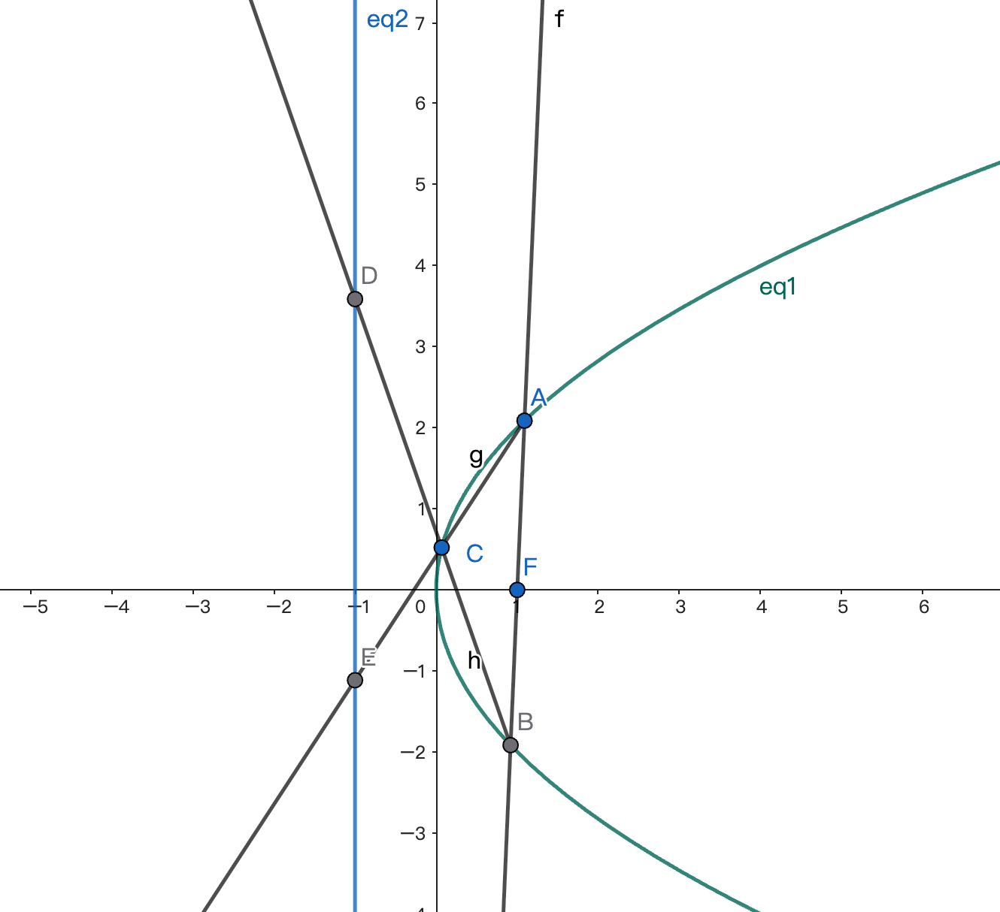

+++
title = '抛物线X'
date = 2025-03-31T13:26:08+08:00
draft = false
tags = ["几何"]
+++

## 已知

抛物线$\Gamma$方程为$y^2=4x$，焦点为$F$。直线$l$过焦点交$\Gamma$于A、B两点。C是抛物线上动点，$AC$、$BC$分别交抛物线的准线于D、E。

求证：
$$
\overrightarrow{OE} \cdot \overrightarrow{OD} = -3
$$
为定值。
<!--more-->

## 题解

我也不知道这个题应该取个什么标题。索性叫X吧，因为图里会有交叉直线。

要证：
$$
\overrightarrow{OE} \cdot \overrightarrow{OD} = -3
$$
只要证：
$$
y_D \cdot y_E = -4
$$

### 设线（单斜率）

最简单直接的想法就是：

设$l: x=ty+1$，和抛物线联立得到：

$$
y^2-4ty-4=0
$$

设$A(x_1,y_2)$以及$B(x_2,y_2)$，再设$\color{red}C(x_0, y_0)$。

那么：
$$
y_1+y_2 = 4t, \quad y_1y_2 = -4
$$

直线$AC$的方程为：
$$
\frac{y-y_0}{x-x_0} = \frac{y_1-y_0}{x_1-x_0}
$$
令$x=-1$得到$D$点的纵坐标：
$$
y_D = y_0 + (-1-x_0)\frac{y_1-y_0}{x_1-x_0}
$$
其中
$$
\color{red} x_1-x_0 = \frac{1}{4}(y_1^2-y_0^2) = \frac{1}{4}(y_1-y_0)(y_1+y_0)
$$
所以：
$$
\begin{aligned}
&y_D \\\\
= &y_0 + (-1-x_0)\frac{4}{y_1+y_0}\\\\
= &\frac{y_0y_1+y_0^2-4-4x_0}{y_1+y_0}\\\\
= &\frac{y_0y_1-4}{y_1+y_0}
\end{aligned}
$$
同理：
$$
y_E = \frac{y_0y_2-4}{y_2+y_0}
$$

那么：
$$
\begin{aligned}
&y_Dy_E \\\\
= &\frac{y_0y_1-4}{y_1+y_0} \cdot \frac{y_0y_2-4}{y_2+y_0}\\\\
= &\frac{y_0^2y_1y_2+16-4y_0(y_1+y_2)}{y_1y_2+y_0^2+y_0(y_1+y_2)}\\\\
= &\frac{-4y_0^2+16+16ty_0}{-4+y_0^2-4ty_0} = -4
\end{aligned}
$$

### 设线陷阱

当然，上面设线法求解的过程中，我们用了很多技巧进行化简（也就是红色的部分）。

如果不使用他们，计算就会非常复杂，难以继续。

A、B的设法不变，我们设$\color{darkgreen}C(\frac{1}{4}m^2, m)$。

依然是：
$$
y_D = m + (-1-\frac{1}{4}m^2)\frac{y_1-m}{x_1-\frac{1}{4}m^2}
$$
和
$$
y_E = m + (-1-\frac{1}{4}m^2)\frac{y_2-m}{x_2-\frac{1}{4}m^2}
$$

这次我们直接相乘：
$$
\begin{aligned}
&y_D\cdot y_E \\\\
= &m^2 + (1+\frac{1}{4}m^2)^2{\color{green}\frac{y_1-m}{x_1-\frac{1}{4}m^2}\cdot\frac{y_2-m}{x_2-\frac{1}{4}m^2}}\\\\
&-m(1+\frac{1}{4}m^2)({\color{green}\frac{y_1-m}{x_1-\frac{1}{4}m^2}+\frac{y_2-m}{x_2-\frac{1}{4}m^2}})
\end{aligned}
$$

其中：
$$
\begin{aligned}
&\frac{y_1-m}{x_1-\frac{1}{4}m^2}\cdot\frac{y_2-m}{x_2-\frac{1}{4}m^2}\\\\
= &\frac{y_1y_2-m(y_1+y_2)+m^2}{x_1x_2 - \frac{1}{4}m^2(x_1+x_2)+\frac{1}{16}m^4}
\end{aligned}
$$

我们已经计算过：
$$
y_1+y_2 = 4t,\quad y_1y_2=-4
$$
那么：
$$
x_1+x_2 = \frac{1}{4}(y_1^2+y_2^2)=4t^2+2, \quad x_1x_2 = \frac{1}{16}y_1^2y_2^2 = 1
$$

所以：
$$
\begin{aligned}
&\frac{y_1-m}{x_1-\frac{1}{4}m^2}\cdot\frac{y_2-m}{x_2-\frac{1}{4}m^2}\\\\
= &\frac{y_1y_2-m(y_1+y_2)+m^2}{x_1x_2 - \frac{1}{4}m^2(x_1+x_2)+\frac{1}{16}m^4}\\\\
= &\frac{-4-4mt+m^2}{1-\frac{1}{4}m^2(4t^2+2)+\frac{1}{16}m^4}\\\\
= &\frac{-4-4mt+m^2}{1-m^2t^2-\frac{1}{2}m^2+\frac{1}{16}m^4}
\end{aligned}
$$

很难继续算下去。

### 另辟蹊径（双斜率）

上面的陷阱给了我们一个**重要的启发**：
$$
\begin{aligned}
&y_D\cdot y_E \\\\
= &m^2 + (1+\frac{1}{4}m^2)^2{\color{green}\frac{y_1-m}{x_1-\frac{1}{4}m^2}\cdot\frac{y_2-m}{x_2-\frac{1}{4}m^2}}\\\\
&-m(1+\frac{1}{4}m^2)({\color{green}\frac{y_1-m}{x_1-\frac{1}{4}m^2}+\frac{y_2-m}{x_2-\frac{1}{4}m^2}})
\end{aligned}
$$

这里面绿色的不都是斜率嘛，我们直接设这些斜率不就完了。

也就是设：
$$
AC:x=t_1(y-y_C)+x_C,\quad BC:x=t_2(y-y_C)+x_C
$$

AC直接和抛物线联立得到：
$$
y^2 - 4t_1y+4t_1y_C-4x_C=0
$$
所以：
$$
y_A+y_C = 4t_1 \implies y_A = 4t_1-y_C
$$
同理：
$$
y_B = 4t_2-y_C
$$

我们知道，$AB$过焦点等价于：
> 💡如果你不知道，这个结论实际上可以在几行就得到证明。

$$
y_Ay_B = -4 = (4t_1-y_C)(4t_2-y_C)
$$

这是唯一的约束条件了，稍微整理就得到：
$$
\color{blue}y_C(t_1+t_2) = 4t_1t_2+\frac{1}{4}y_C^2+1 = 4t_1t_2+x_C+1
$$

下面我们来计算$y_D\cdot y_E$，在AC、BC的方程里令$x=-1$立即得到：
$$
\begin{aligned}
&y_D\cdot y_E \\\\
= &(\frac{-1-x_C}{t_1}+y_C)(\frac{-1-x_C}{t_2}+y_C)\\\\
= &\frac{(1+x_C)^2}{t_1t_2}+y_C^2-(1+x_C)y_C(\frac{1}{t_1}+\frac{1}{t_2})\\\\
= & \frac{(1+x_C)^2 + t_1t_2y_C^2 - (1+x_C)y_C(t_1+t_2)}{t_1t_2}
\end{aligned}
$$

消去$y_C(t_1+t_2)$得到：

$$
\begin{aligned}
&y_D\cdot y_E \\\\
= &\frac{(1+x_C)^2 + t_1t_2y_C^2 - (1+x_C)({\color{blue}4t_1t_2+x_C+1})}{t_1t_2}\\\\
= &\frac{t_1t_2y_C^2 - 4t_1t_2(1+x_C)}{t_1t_2}\\\\
= &\frac{4t_1t_2x_C - 4t_1t_2(1+x_C)}{t_1t_2} \\\\
= &-4
\end{aligned}
$$

甚好！

### 反向结论

> 下面提到的数值仅在我们的题设中成立。

我们知道，在**抛物线**上两点的*纵坐标乘积*如果是$-4$，那么他们的连线肯定过焦点。

题干实际上告诉我们一个有趣的结论，在**抛物线的准线**上两点的*纵坐标乘积*如果是$-4$，那么他们对抛物线的同一点作割线，会产生焦点弦。
