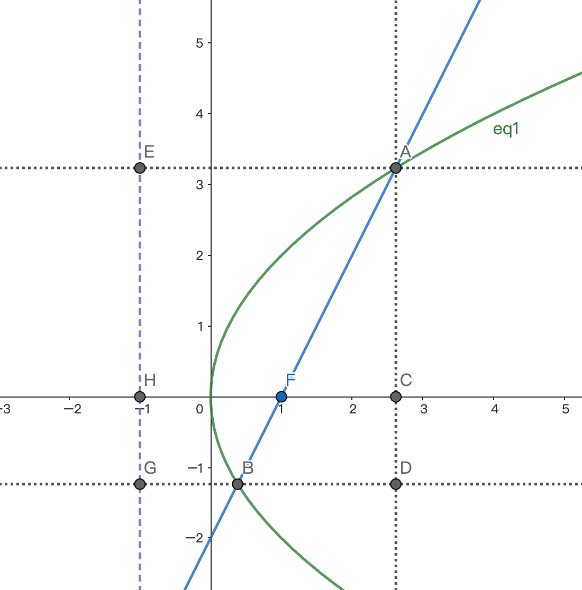

+++
title = '抛物线的准线'
date = 2024-11-03T16:33:52+08:00
draft = false
tags = ["几何"]
+++

## 已知
抛物线$\Gamma$方程为：
$$
y^2 = 4x
$$
过焦点$F$的直线$l$交$\Gamma$于$A,B$两点，满足$|AF|=2|BF|$

1. 求$l$的斜率

$$
k_l = \pm 2\sqrt 2
$$


2. 求$|AB|$

$$
|AB| = \frac{9}{2}
$$


## 题解

### 设线法（韦达定理）
显然$l$的斜率非零，设斜率的倒数为$t$，那么其方程为：
$$
x = ty+1
$$
和抛物线方程联立得到：
$$
y^2-4ty-4=0
$$
不妨设$A(x_1,y_1)$以及$B(x_2,y_2)$根据韦达定理我们知道
$$
y_1+y_2 = 4t, \quad y_1y_2=-4
$$
$|AF|=2|BF|$可以推出：
$$
|y_1| = 2|y_2|
$$
实际上他们一定是异号的：
$$
y_1 = -2y_2
$$
于是：
$$
y_1y_2 = -2y_2^2=-4 \implies y_2=\pm\sqrt{2}, y_1=\mp 2\sqrt{2}
$$
那么
$$
y_1+y_2 = \pm\sqrt{2}
$$
根据韦达定理的两根之和关系，立即得到$l$的斜率即为：
$$
k_l = \frac{1}{t} = \frac{4}{y_1+y_2} = \pm 2\sqrt{2}
$$
此外容易求得A、B的坐标是：
$$
A(2,\mp 2\sqrt{2}),\quad B(\frac{1}{2}, \pm \sqrt{2})
$$
所以
$$
|AB| = \sqrt{(2-\frac{1}{2})^2+(3\sqrt{2})^2} = \frac{9}{2}
$$

### 设点法（解方程）
不妨设$A(x_1,y_1)$以及$B(x_2,y_2)$，那么
$$
y_1^2 = 4x_1\\\\
y_2^2 = 4x_2
$$
$|AF|=2|BF|$可以推出：
$$
|y_1| = 2|y_2|
$$
实际上他们一定是异号的：
$$
y_1 = -2y_2
$$
$AB$通过$F$点，可以知道向量共线
$$
\vec{FA} \parallel \vec{FB}
$$
于是
$$
y_2(x_1-1) = y_1(x_2-1)
$$

四个方程，四个未知量：
$$
y_1^2 = 4x_1\\\\
y_2^2 = 4x_2\\\\
y_1 = -2y_2\\\\
y_2(x_1-1) = y_1(x_2-1)\\\\
$$
前三个式子可以推出：
$$
x_1 = \frac{1}{4}y_1^2 = y_2^2=4x_2
$$
最后一个式子两边平方就是：
$$
y_2^2(x_1-1)^2 = y_1^2(x_2-1)^2=4y_2^2(x_2-1)^2
$$
于是
$$
(x_1-1)^2 = 4(x_2-1)^2
$$
也就是：
$$
(4x_2-1)^2=4(x_2-1)^2
$$
解得：
$$
x_2 = \frac{1}{2}
$$
进而我们知道
$$
x_1 = 2
$$
此时容易求得A、B的坐标是：
$$
A(2,\mp 2\sqrt{2}),\quad B(\frac{1}{2}, \pm \sqrt{2})
$$

### 几何法（准线！）

如图所示，分别作$AE、BG$垂直于准线$x=-1$。然后反向延长$BG$，再作$AD\perp BG$交x轴于$D$。

假设$|AF|=a$,$|BF|=b$那么根据抛物线的性质我们知道
$$
|AE|=|AF|=a\\\\
|BG|=|BF|=b
$$

显然，$\mathrm{AEGD}$是矩形，所以$|DG|=|AE|=a$

那么
$$
|BD| = |DG|-|BG| = a-b
$$

所以直线$l$的斜率为
$$
\tan \angle ABD = \frac{\sqrt{AB^2-BD^2}}{BD} = \sqrt{\frac{(a+b)^2-(a-b)^2}{(a-b)^2}}
$$

也就是
$$
k_l = \pm\sqrt{\frac{4ab}{(a-b)^2}}
$$

> 根据对称性，正负都可以取

此外，显然有相似三角形：

$$
\triangle ABD \sim \triangle AFC
$$

所以
$$
\frac{FC}{BD} = \frac{AF}{AB} = \frac{a}{a+b}
$$

所以
$$
FC = \frac{a(a-b)}{a+b}
$$

所以焦准距
$$
p = CH-FC = a- \frac{a(a-b)}{a+b} = \frac{2ab}{a+b}
$$

> 目前为止，我们还没有使用题设，只是推导了最一般的情况。实际上，这个方法对椭圆和双曲线同样适用。

带入题设条件：
$$
a=2b
$$

我们知道：
$$
k_l = \pm 2\sqrt{2}
$$
以及
$$
p = \frac{4b^2}{3b} = 2
$$
也就是
$$
b = \frac{3}{2}, \quad a=3
$$
所以
$$
|AB| = a+b = \frac{9}{2}
$$
